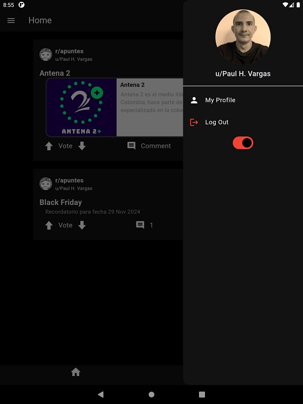
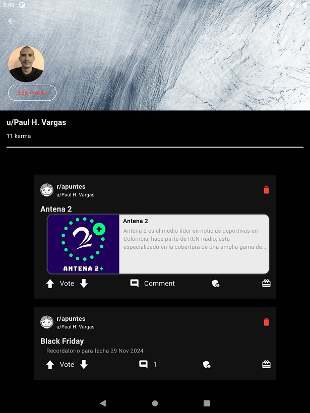
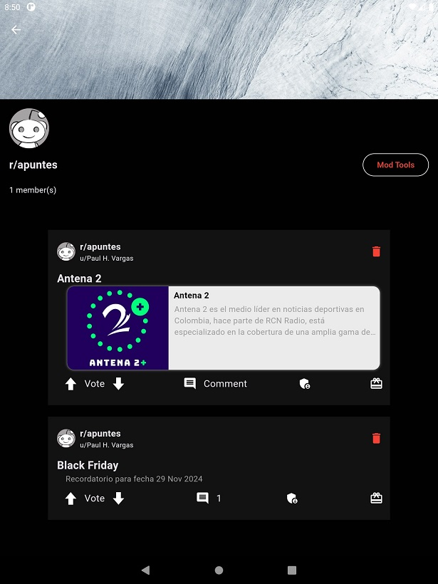
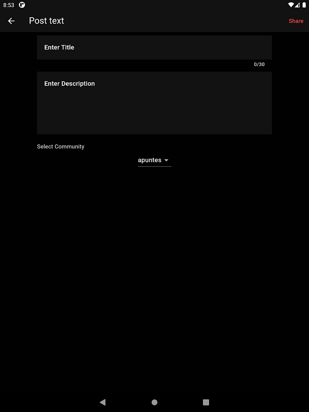

# Reddit Clone (Flutter project)
An Android clone app for the Reddit web service.

## Architecture Used
MVC Architecture

## Packages
- Flutter + Dart
- Routemaster
- Firebase (Auth, Storage, cloud firestore)
- fpdart
- file_picker
- Flutter riverpod
- uuid
- Dotted border
- Shared preferences

## Output
 ### Login page

 ### Home page

 ### Profile page

 ### Edit Profile page

### Community page

### Create Community page

### Post Type page

### Create Post page

